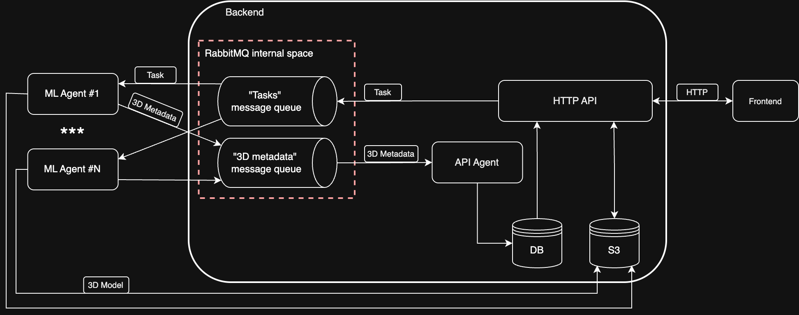

# README

## Description

This repository contains source code of backend system for 3D Avatar Generation service. It consists of four parts:
* HTTP API made with FastAPI. It is used for interaction with frontend.
* RabbitMQ message broker. It is used for communication with ml-workers (aka ml-agents) 
* PostgreSQL database. It is used for storing user information, tasks and media metadata
* MinIO S3 storage. It is used for storing media data, such as images uploaded by users and generated 3D models

Overall architecture diagram is show below



## How to run?

1. Go to project root

2. Create environment file using:
```shell
make env
```

3. Open newly created `.env` file and initialize `SECRET_KEY` and `REFRESH_SECRET_KEY` variables using `openssl rand -hex 32` command

4. If necessary, edit any other variables in `.env` file

5. Run deployment to Docker Compose:

```shell
make deploy 
```

6. If you don't have any alembic revisions, generate one using:

```shell
make revision
```

7. Migrate database to your revision:

```shell
make migrate
```

8. API Swagger is accessible via `http://{APP_HOST}:8080/docs` link

## Project Structure

```
.
|__app                      # FastAPI application
|
|__cmd                      # Convenient scripts for running parts of project
|  |__migrator              # Database migrator
|  |__service               # FastAPI service
|  |__worker                # API Worker for listening {RABBITMQ_TASKS_RESULTS_QUEUE} queue
|
|__config                   # Environment variables parser
|
|__deployment               # Docker files
|  |__docker-compose.yml    # Defines all project's containers
|  |__Dockerfile            # for building FastAPI service and API Worker into Docker images
|
|__src                      # source code of FastAPI service
|  |__data                  # Data layer - Communication with database, RabbitMQ, MinIO
|  |__domain                # Domain layer - bussiness logic (proccessing data from Data Layer and passing it to Presentation Layer)
|  |__presentation          # Presentation layer - handles API requests and responses
|
|__worker                   #Source code of API Worker
```
